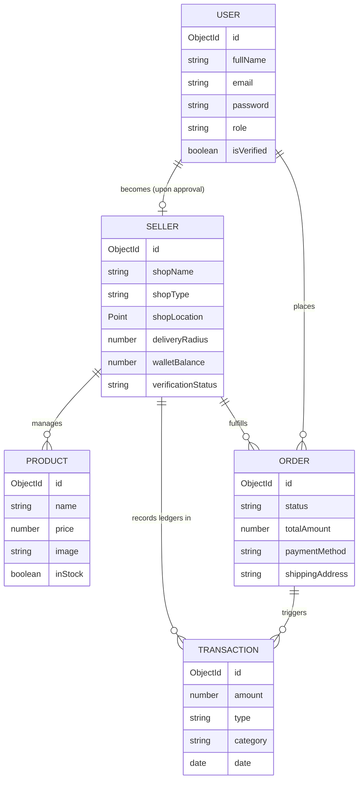

# 🛒 HyperLocal Marketplace

A modern, high-performance **multi-tenant hyper-local marketplace** platform built using Next.js, Tailwind CSS, MongoDB, and Stripe. This project connects local physical vendors with nearby customers using geospatial querying, integrated payment processing, dynamic ledger wallets, and role-based dashboards.

---

## 🌟 Key Features

### 👥 Role-Based Architecture
*   **Customers**: Geolocation-aware shop browsing, real-time distance calculation, shopping carts restricted per-shop, secure checkout via Stripe, order history, and rating/review systems.
*   **Sellers (Vendors)**: Self-onboarding with document verification, customizable shop profiles (banner, logo, hours, delivery radius), product management, live sales analytics dashboards (powered by Recharts), and a double-entry transaction ledger.
*   **Admins**: Comprehensive system-wide control panel, vendor verification approval flows, transaction histories, debt-level alerts, commission management, and global platform analytics.

### 🛰️ Advanced Geolocation Capabilities
*   **MongoDB `2dsphere` Indexing**: Highly optimized geospatial queries to filter shops within delivery radius.
*   **Haversine Distance Matching**: Real-time client & server-side calculations to ensure customers only purchase from shops within physical reach.

### 💰 Robust Financial & Wallet Engine
*   **Stripe Integration**: Automated split payments and secure checkout sessions.
*   **Ledger-Based Wallet System**: Built-in transactional logging (Credit/Debit) for order earnings, commission deductions (e.g., platform service fees), payouts, and dues clearing.
*   **Debt Enforcement**: Automatic warning system when a seller's outstanding balance exceeds thresholds.

### 🔐 Security & Reliability
*   **Next-Auth & Role-Based Guarding**: Middleware-protected route groups separating `(admin)`, `(vendor)`, and `(customer)` spaces.
*   **MongoDB TTL Indexes**: Automated account cleanup for unverified verification attempts after 24 hours.
*   **Secure Media Uploads**: High-performance image transformation and storage using Next-Cloudinary.

---

## 🛠️ Technology Stack

| Layer | Technologies |
| :--- | :--- |
| **Frontend** | React 19, Next.js (App Router), Tailwind CSS v4, Lucide Icons, Recharts |
| **Backend / API** | Next.js Server Actions & API Routes, Mongoose |
| **Database** | MongoDB Atlas (Geospatial indexing, TTL indices) |
| **Authentication** | Next-Auth.js, Bcryptjs |
| **Payments** | Stripe |
| **File Storage** | Cloudinary |
| **Mailing** | Nodemailer (Email verification, OTP validation) |

---

## 📐 Architecture & Data Model



---

## ⚡ Engineering Highlights (What Makes This Project Portfolio-Ready)

1.  **Geospatial Optimization**: Rather than searching all vendors and doing memory calculations, this app utilizes native MongoDB `$near` queries on a `2dsphere` index, ensuring query times remain O(log N) even with thousands of local shops.
2.  **Partial TTL Indexes**: Utilized partial filter expressions in Mongoose indexes to automatically expire and prune unverified registrations within 24 hours, preventing database bloat while keeping verified records permanent.
3.  **Strict Transactional Integrity**: Vendor wallets are designed around an immutable ledger array. Instead of simply modifying `walletBalance`, every balance change requires a matching transaction record with strict classification (`Order_Earning`, `Commission_Deduction`, etc.) to facilitate easy auditing.
4.  **Route-Group Segregation**: Clean directory structuring utilizing Next.js route groups (`(admin)`, `(vendor)`, and `(public)`) to isolate layouts and middleware security checks, improving codebase maintainability.

---

## ⚙️ Getting Started

### 1. Clone the repository
```bash
git clone https://github.com/your-username/local-marketplace.git
cd local-marketplace
```

### 2. Install dependencies
```bash
npm install
```

### 3. Setup Environment Variables
Create a `.env` file in the root directory:
```env
# Database
MONGODB_URI=your_mongodb_connection_string

# Auth
NEXTAUTH_SECRET=your_nextauth_jwt_secret
NEXTAUTH_URL=http://localhost:3000

# Stripe
STRIPE_SECRET_KEY=your_stripe_secret_key
NEXT_PUBLIC_STRIPE_PUBLISHABLE_KEY=your_stripe_pub_key

# Cloudinary
NEXT_PUBLIC_CLOUDINARY_CLOUD_NAME=your_cloud_name
CLOUDINARY_API_KEY=your_api_key
CLOUDINARY_API_SECRET=your_api_secret

# Mailer
MAIL_HOST=smtp.gmail.com
MAIL_PORT=587
MAIL_USER=your_email@gmail.com
MAIL_PASS=your_app_password
```

### 4. Run the Dev Server
```bash
npm run dev
```
Open [http://localhost:3000](http://localhost:3000) to view the application.

---
Live link : https://martly.me

## 📈 Future Enhancements
*   [ ] Live delivery agent tracking via WebSockets.
*   [ ] Multi-shop single checkouts (cart partitioning).
*   [ ] AI-based product recommendation matching user purchase habits.
